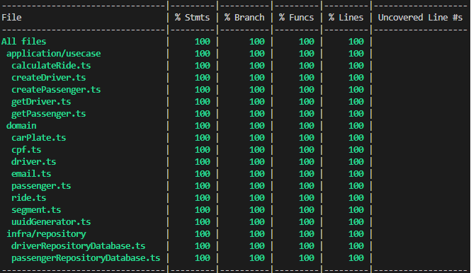

# Mini Uber: Transportation Platform with Solid Development Principles, Clean Archtecture and DDD

Mini Uber is a **Node.js application** that adheres to software development principles, including **Clean Code**, **TDD**, **OO**, **Design Patterns**, **SOLID**, and **Domain-Driven Design (DDD)**. With a focus on clean code, rigorous testing, robust architecture, and well-defined domain design.

**Key Principles:**

- **Clean Code and TDD:** We maintain clean and reliable code using TDD, writing tests before production code.

- **Object Orientation (OO):** We employ OO to create a robust and understandable domain model.

- **Design Patterns:** We apply proven design patterns to tackle complex challenges.

- **SOLID:** We embrace SOLID principles to maintain a flexible and scalable architecture.

- **Domain-Driven Design (DDD):** We use DDD to clearly and effectively define and organize the application's domain.

- **Clean Architecture:** We distinctly separate concerns between the core domain and external layers.

# Coverage

